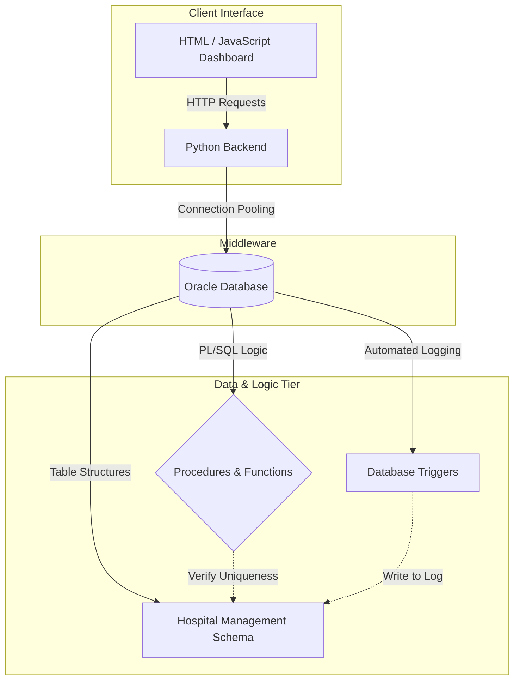

# Enterprise Hospital Appointment & Resource Management System

A comprehensive, robust Database Management System (DBMS) designed to facilitate clinical operations, room allocation, and dynamic doctor appointment scheduling. Built heavily on Oracle PL/SQL, this system focuses on enforcing strict data-integrity rules, automating logistics via database triggers, and preventing scheduling overlap natively at the data tier.

## System Architecture & Flow

The system is designed with a strict separation of concerns, heavily utilizing database-level logic to ensure concurrent consistency during high-traffic clinical operations.



## Core Functionalities

### 1. Robust Constraint Enforcement
The core schema extensively utilizes intrinsic database constraints (Primary Keys, Foreign Keys) to enforce referential integrity across Patients, Doctors, Rooms, and Appointments. It prevents orphaned data elements inherently.

### 2. Autonomous Logging (PL/SQL Triggers)
All critical operations (such as a changing room allocation or updating patient diagnostics) are captured by autonomous backend triggers. 
- **Room Status Auditing:** Dynamically fires `BEFORE UPDATE` or `AFTER UPDATE` to capture state transition logs into standalone audit tables without burdening the application middleware.

### 3. Algorithmic Conflict Resolution
Doctor availability and appointment scheduling logic is abstracted away from the GUI and placed natively inside high-speed PL/SQL Procedures. 
- **Overlap Prevention:** Determines if a requested appointment slot conflicts with a doctor's active schedule, safely aborting transactions via implicit commits/rollbacks.

## Technology Stack

- **Relational Database:** Oracle SQL 
- **Database Programming:** Native PL/SQL (Procedures, Functions, and Triggers)
- **Middleware Integration:** Python (Flask/FastAPI) establishing native connector sessions.
- **Frontend GUI:** HTML5 & JavaScript interactive scheduling interfaces.

## Project Structure

- `/docs`: Extentive project reports and architectural documentation.
- `/sql/schema`: Data definition language (DDL) scripts for generating absolute initial states.
- `/sql/features`: Compiled library of PL/SQL modules.
- `/sql/samples`: Complete insertion mockers and complex SQL querying samples.
- `/sql/gui`: Python middleware routing and the graphical representation layer.

## Quick Start Installation

1. **Acquire the Repository:**
   ```bash
   git clone https://github.com/arnavnaik22/HospitalManagementSystem.git
   cd HospitalManagementSystem
   ```

2. **Initialize the Database:**
   Ensure you have an active Oracle session configured. Execute the initialization scripts sequentially:
   - First, run `/sql/schema/Hospital_Management_System.sql`
   - Second, inject mock-state using `/sql/samples/Hospital_Sample_Inserts.sql`
   - Finally, compile the intelligent logic via `/sql/features/PLSQL.sql`

3. **Boot the Middleware:**
   ```bash
   cd sql/gui
   python backend.py
   ```
   Open `index.html` natively in your browser to interact with the scheduling engine.
